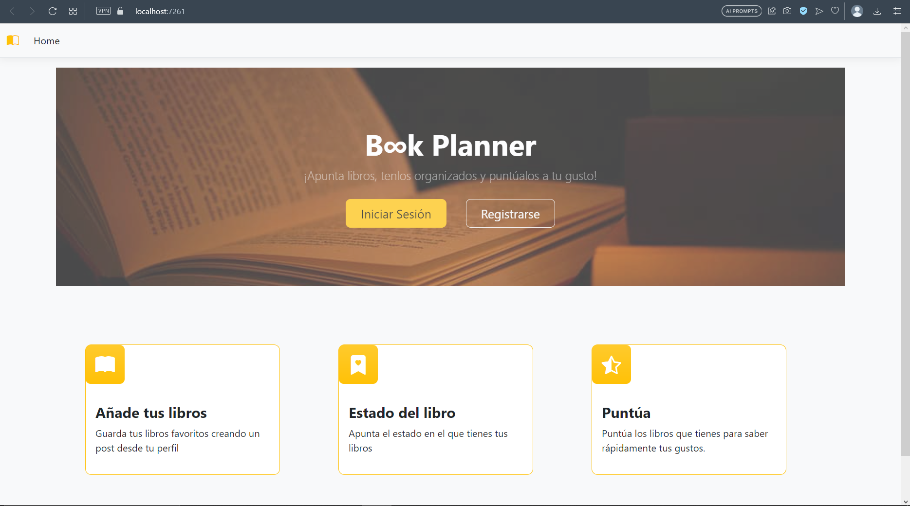

# TFG - _B∞k Planner_

Este trabajo consiste en al creación de una aplicación en la que, al igual que en una agenda, puedas apuntar los libros que _quieres leer_, _estas leyendo_ o _has leído_, junto con el título del libro, valoración y más datos.

## Implementación

Es una aplicación ASP.NET core MVC la cual se ha implementado utilizando Visual Studio 2022. Para la base de datos se ha configurado la conexión mediante Microsoft SQL Server Management.

Para ejecutar la aplicación, sigue los siguientes pasos:
1. Clona el repositorio de Github en tu ordenador usando `https://github.com/mdesisoy/TFG-AppLibros.git`.
2. Ejecuta Visual Studio.
3. Clica en Archivo > Abrir > Proyecto o solución y elige la solución del proyecto.

**NOTA**: Puedes ejecutar SQL Server y controlar los datos que se introducen en la Base de Datos.

## Funcionalidad

En **Book Planner** podrás registrarte para luego iniciar sesión con tu usuario ya guardado en la base de datos.

Una vez en tu perfil podrás crear una nueva entrada, lo que significa crear un nuevo libro que quieras añadir a tu biblioteca, o ver tu listado de libros y editar cualquiera ya guardado desde ahí.

Por supuesto, en el perfil encontrarás el botón de cerrar sesión y además un contador con los libros que has marcado como leídos.

## Contributing

¡Las contribuciones son siempre bienvenidas!

Si deseas contribuir a este proyecto, por favor crea una nueva rama para tu contribución y crea un Pull Request para que pueda revisarlo.

Gracias - `@https://github.com/mdesisoy` :fallen_leaf:

